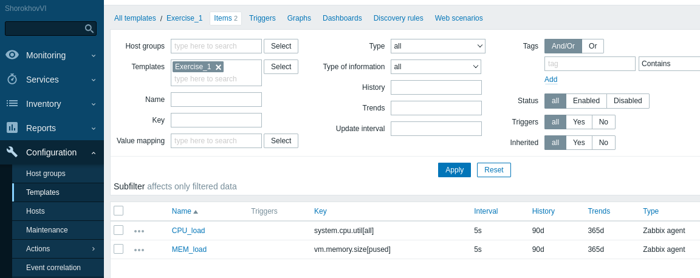
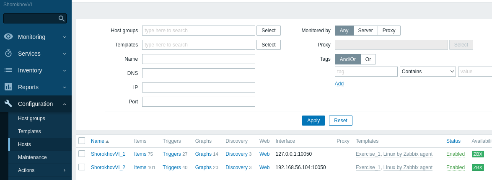
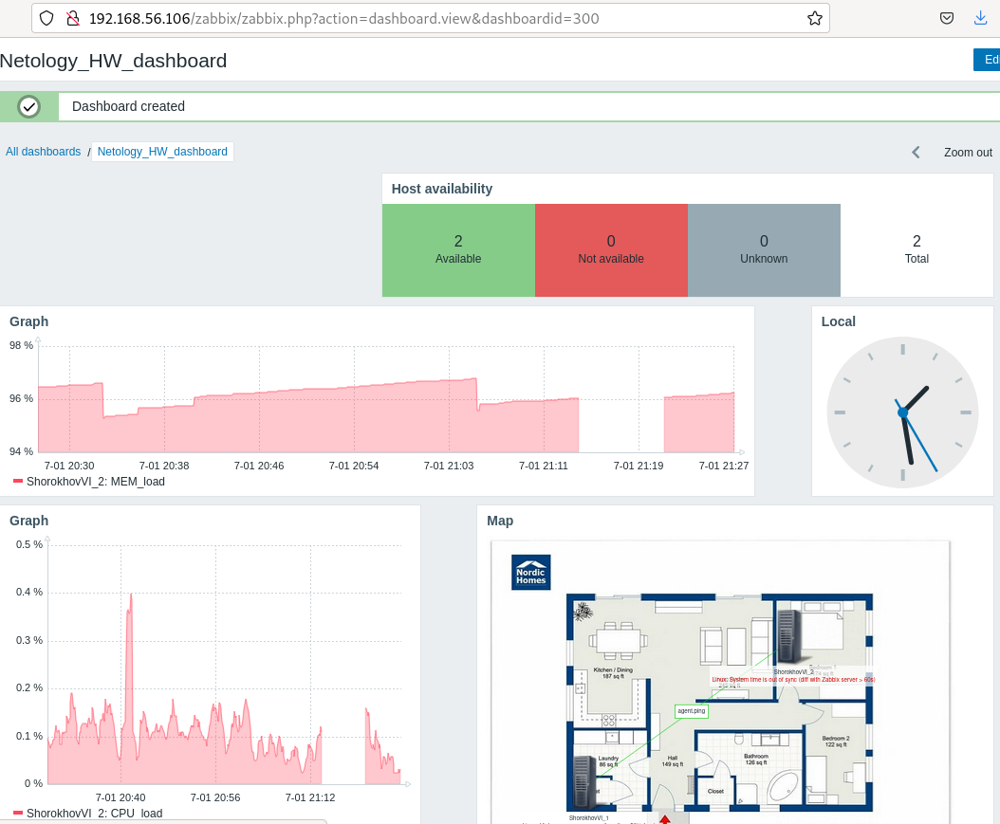
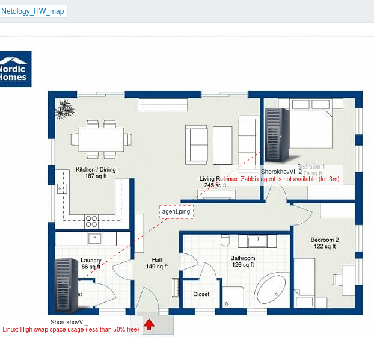
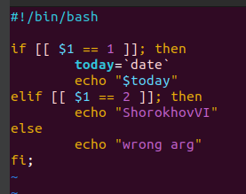
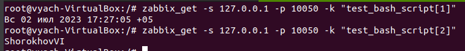
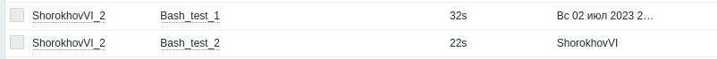
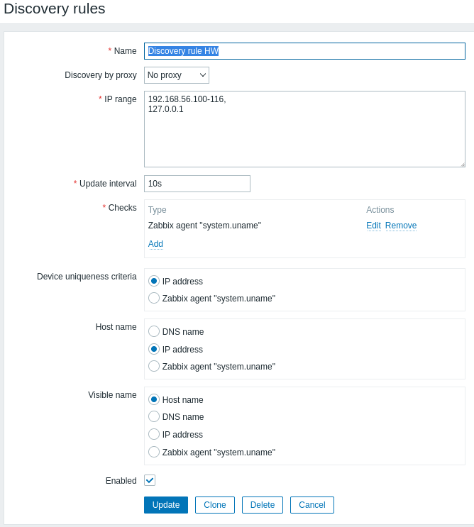
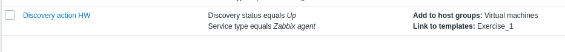
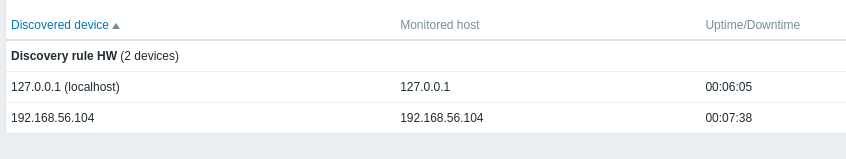

# Домашнее задание к занятию "`Система мониторинга Zabbix. Часть 2`" - `Шорохов Вячеслав`

---

### Задание 1

Создайте свой шаблон, в котором будут элементы данных, мониторящие загрузку CPU и RAM хоста.

Требования к результату:
Прикрепите в файл README.md скриншот страницы шаблона с названием «Задание 1»

#### Решение:

`Скриншот страницы шаблона:

---

### Задание 2

Добавьте в Zabbix два хоста и задайте им имена <фамилия и инициалы-1> и <фамилия и инициалы-2>. Например: ivanovii-1 и ivanovii-2.

Требования к результату:
Результат данного задания сдавайте вместе с заданием 3

---

### Задание 3

Привяжите созданный шаблон к двум хостам. Также привяжите к обоим хостам шаблон Linux by Zabbix Agent.

Требования к результату:
Прикрепите в файл README.md скриншот страницы хостов, где будут видны привязки шаблонов с названиями «Задание 2-3». Хосты должны иметь зелёный статус подключения

#### Решение:

`Скриншот страницы хостов:

---
### Задание 4

Создайте свой кастомный дашборд.

Требования к результату:
Прикрепите в файл README.md скриншот дашборда с названием «Задание 4»

#### Решение:

`Скриншот дашборда:

---
## Дополнительные задания (со звездочкой*)

### Задание 5

Создайте карту и расположите на ней два своих хоста.

Требования к результату:
Прикрепите в файл README.md скриншот карты, где видно, что триггер сработал, с названием «Задание 5»

#### Решение:

`Скриншот карты:

---

### Задание 6

Создайте UserParameter на bash и прикрепите его к созданному вами ранее шаблону. Он должен вызывать скрипт, который:
- при получении 1 будет возвращать ваши ФИО,
- при получении 2 будет возвращать текущую дату.

Требования к результату:
Прикрепите в файл README.md код скрипта, а также скриншот Latest data с результатом работы скрипта на bash, чтобы был виден результат работы скрипта при отправке в него 1 и 2

#### Решение:

`Скрипт на bash:

`Результат в zabbix-get:

`Результат в веб-интерфейсе:

---

### Задание 8

Настройте автообнаружение и прикрепление к хостам созданного вами ранее шаблона.

Требования к результату:
Прикрепите в файл README.md скриншот правила обнаружения, а также скриншот страницы Discover, где видны оба хоста.*

#### Решение:

`Правило обнаружения:

`Действие при обнаружении:

`Обнаруженные хосты в мониторинге:

---
